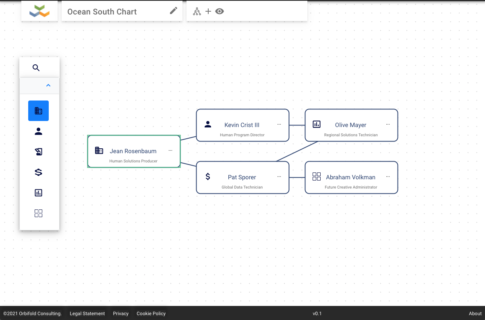

# Syncfusion Diagramming

There are plenty of diagramming frameworks out there. Syncfusion is certainly not the most sophisticated one but considering it comes 'free' together with another hundred widgets it does a good job. What differentiates diagramming frameworks is the richness in layout algorithms. Syncfusion has just a couple of them and is, hence, fairly basic. Still, if your customer needs only basic diagram (like a hierarchy, a mindmap or a dozen of shapes) then it does the job.

This sample assembles a standard diagramming app which you can re-use. Lots of the features of the Syncfusion framework are a bit hidden, so this sample brings it all together. 

## Setup

- Install things as usual with `npm i`.
- Run it with `npm start`.

## Info and Support

Info and support [@TheOrbifold](https://twitter.com/theorbifold). 
